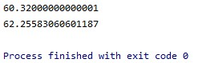

# Calculadora Estadística

En este proyecto se presenta una calculadora estadística que cuenta con la capacidad de calcular la media y la
desviación estándar de un set de datos que se leen de un archivo de texto.

## Principales características

La calculadora estadística nos permite calcular la media de un set de datos ubicados en un archivo de texto, se puede
utilizar de la siguiente manera:

### Ejecución

Cuando se ejecuta la calculadora esta viene pre-cargada con un set de datos, de los cuales calcula la media y la
desviación estándar, el resultado luce de la siguiente forma:



En donde el primer resultado es la media del set de datos y el segundo resultado es la desviación estándar.

### Cómo agregar un set de datos propio

Para agregar un set de datos propio, debe seguir los siguientes pasos:

1. Crear un archivo de texto con los datos, uno por línea y ubicarlo en la carpeta resources que se encuentra en la ruta
   src/main.
2. Reemplazar la variable "fileName" ubicada en el archivo App.java, ubicado en la ruta src/main/java/edu/eci/arep por
   el nombre de su archivo de datos.
3. Ejecutar el programa y analizar la salida de datos.

## Cómo obtener el proyecto

### Prerequisitos

Asegúrese de tener git instalado en su máquina, lo puede hacer desde la [página oficial][gitLink].

### Descarga del proyecto

Clone el proyecto utilizando el siguiente comando:

```
git clone https://github.com/danielrincon-m/AREP_LAB1.git
```

## Correr las pruebas unitarias

### Prerequisitos

Un IDE que soporte proyectos Java, o una instalación de Maven en su sistema, puebe obtenerlo desde
la [página oficial.][mvnLink]

### Ejecución de pruebas

Las pruebas pueden ser ejecutadas desde la sección de pruebas de su IDE o si tiene maven puede navegar a la carpeta
principal del proyecto y ejecutar el comando

```
mvn test
```

<!--
### And coding style tests

Explain what these tests test and why

```
Give an example
```

## Deployment

Add additional notes about how to deploy this on a live system
-->

## Herramientas utilizadas

* [IntelliJ IDE](https://www.jetbrains.com/es-es/idea/download/) - IDE de desarrollo
* [Maven](https://maven.apache.org/) - Manejo de Dependencias
* [JUnit](https://junit.org/junit4/) - Pruebas unitarias
* [GitHub](https://github.com/) - Repositorio de código

## Autor

**Daniel Felipe Rincón Muñoz:** *Planeación y desarrollo del proyecto* -
[Perfil de GitHub](https://github.com/danielrincon-m)

## Licencia

Este proyecto se encuentra licenciado bajo **GNU General Public License** - consulte el archivo [LICENSE.md](LICENSE.md)
para más detalles.

<!-- 
## Acknowledgments 

* Hat tip to anyone whose code was used
* Inspiration
* etc
-->

[gitLink]: https://git-scm.com/downloads

[mvnLink]: https://maven.apache.org/download.cgi